


&nbsp;
&nbsp;
&nbsp;
&nbsp;
&nbsp;

I started in robotics and I'm moving toward space systems. My M.Sc. at the University of Bremen points at sensing, processing and communication for space-related systems, and the work I want to do is robotic, autonomous and intelligent systems that operate where humans can't easily go.

Python, control theory, MATLAB/Simulink and ROS2 are the bridge between those two fields. I'm building them deliberately on top of hands-on robotics work I've already done: a robotic arm, a pick-and-place robot, a quadcopter, an AGV prototype, a satellite project and industrial robot training.


Each project gets its own repository and write-up as I document it. Details marked `[PLACEHOLDER]` are being filled in.

### Space


<b>PicoSat: project details</b>

<ul>
<li><b>Built:</b> <code>[PLACEHOLDER: one or two sentences on what the satellite project did]</code></li>
<li><b>Why:</b> <code>[PLACEHOLDER]</code></li>
<li><b>Stack:</b> <code>[PLACEHOLDER: hardware and software actually used]</code></li>
<li><b>Concepts demonstrated:</b> <code>[PLACEHOLDER]</code></li>
<li><b>Status:</b> <code>[PLACEHOLDER: completed / prototype / archived]</code> · <b>Repo and docs:</b> <i>coming soon</i></li>
</ul>

### Robotics and autonomous systems

<table>
<tr>
<td width="50%" valign="top">

<b>Robotic arm: details</b>

<ul>
<li><b>Built:</b> <code>[PLACEHOLDER]</code></li>
<li><b>Why:</b> <code>[PLACEHOLDER]</code></li>
<li><b>Stack:</b> <code>[PLACEHOLDER]</code></li>
<li><b>Concepts:</b> <code>[PLACEHOLDER]</code></li>
<li><b>Status:</b> <code>[PLACEHOLDER]</code> · <b>Repo:</b> <i>coming soon</i></li>
</ul>

</td>
<td width="50%" valign="top">

<b>Pick-and-place robot: details</b>

<ul>
<li><b>Built:</b> <code>[PLACEHOLDER]</code></li>
<li><b>Why:</b> <code>[PLACEHOLDER]</code></li>
<li><b>Stack:</b> <code>[PLACEHOLDER]</code></li>
<li><b>Concepts:</b> <code>[PLACEHOLDER]</code></li>
<li><b>Status:</b> <code>[PLACEHOLDER]</code> · <b>Repo:</b> <i>coming soon</i></li>
</ul>

</td>
</tr>
<tr>
<td width="50%" valign="top">

<b>Quadcopter drone: details</b>

<ul>
<li><b>Built:</b> <code>[PLACEHOLDER]</code></li>
<li><b>Why:</b> <code>[PLACEHOLDER]</code></li>
<li><b>Stack:</b> <code>[PLACEHOLDER]</code></li>
<li><b>Concepts:</b> <code>[PLACEHOLDER]</code></li>
<li><b>Status:</b> <code>[PLACEHOLDER]</code> · <b>Repo:</b> <i>coming soon</i></li>
</ul>

</td>
<td width="50%" valign="top">

<b>AGV prototype: details</b>

<ul>
<li><b>Built:</b> <code>[PLACEHOLDER: navigation or guidance method, if known]</code></li>
<li><b>Why:</b> <code>[PLACEHOLDER]</code></li>
<li><b>Stack:</b> <code>[PLACEHOLDER]</code></li>
<li><b>Concepts:</b> <code>[PLACEHOLDER]</code></li>
<li><b>Status:</b> <code>[PLACEHOLDER]</code> · <b>Repo:</b> <i>coming soon</i></li>
</ul>

</td>
</tr>
</table>

> The robotic arm above is a project I built. It is separate from the industrial FANUC and ABB robots I trained on, described [below](#industrial).

### More prototypes

<table>
<tr>
<td width="33%" valign="top">
<code>[PLACEHOLDER: one line on what it does]</code>
</td>
<td width="33%" valign="top">
<code>[PLACEHOLDER: one line on what it does]</code>
</td>
<td width="33%" valign="top">
<code>[PLACEHOLDER: one line on what it does]</code>
</td>
</tr>
</table>



The NASA Space Settlement entry was a school-level project/competition: student participation only, with no NASA employment, research or sponsorship. <code>[PLACEHOLDER: contest name, year, result]</code>


This was practical training and hands-on exposure, not professional industrial robotics experience. It connects my Robotics & Automation degree to real industrial systems. `[PLACEHOLDER: duration, dates, training format]`


- **Role:** International Control Board Auditor, AIESEC `[PLACEHOLDER: exact title(s) and dates]`
- **Scope:** audit and compliance across approximately 70 countries in Europe and the Americas `[PLACEHOLDER: confirm exact wording of the scope]`
- **Worked with:** teams and responsibilities connected to India, Australia, Ethiopia, Norway, Finland and Germany

I'm an engineer first. This experience shapes how I work in international teams, which is what space and robotics projects usually involve.

I'm completing a structured **100 Days of Python** course (progress: `[PLACEHOLDER: Day X / 100]`) as deliberate groundwork for robotics and control software. Stronger Python, ROS2 and control projects will replace these as they're finished.

Early projects from the course

Brand Name Generator · Tip Calculator · Treasure Island · Rock Paper Scissors · Password Generator · Escape the Maze · Pizza Order Program


&nbsp;
<!-- TODO: replace # with your LinkedIn URL -->
&nbsp;
<!-- TODO: replace # with mailto:your@email -->

<code>[PLACEHOLDER: LinkedIn URL and public email]</code> · Bremen, Germany

