  

  

    <b>M.Sc. Space Science &amp; Technology · University of Bremen</b> 
    B.Tech Robotics &amp; Automation · Lovely Professional University 
    Space · Robotics · Software · Control
  

  

    <a href="#featured-projects">Projects</a> ·
    <a href="#engineering-journey">Journey</a> ·
    <a href="#technical-profile">Technical profile</a> ·
    <a href="#industrial-robotics-exposure">Industrial robotics</a> ·
    <a href="#international-experience">International</a> ·
    <a href="#contact">Contact</a>
  

## Mission

I started with robotics and I'm moving toward space systems. My Master's direction at Bremen is sensing, processing and communication for space-related systems, and my goal is to work on robotic, autonomous and intelligent systems that operate in space.

I'm building the software and control foundations that connect the two fields. My robotics work was done before this stage, and I'm adding Python, control theory, MATLAB/Simulink, ROS2 and computer vision on top of it.

| Focus | Role in my profile |
|---|---|
| **Space** | Where I'm heading: satellite systems, sensing, processing and communication. |
| **Robotics** | Where I'm coming from: arms, pick-and-place, drones, mobile robots, industrial robot exposure. |
| **Software & control** | The bridge between them: Python, control systems, MATLAB/Simulink, ROS2. |
| **International experience** | Audit and governance work across many countries, alongside my engineering path. |

## Engineering journey

| Stage | What happened |
|---|---|
| **School** | Took part in a school-level project/competition on NASA's Space Settlement theme. This was student participation only, with no NASA employment or affiliation. `[PLACEHOLDER: contest name, year, result]` |
| **B.Tech, Robotics & Automation** | Built engineering projects across several areas: a satellite project (PicoSat), a robotic arm, a pick-and-place robot, a quadcopter, an AGV prototype, an RC car and more. See [Featured projects](#featured-projects). |
| **Industrial training** | Robotics and automation training at DIFACTO Robotics and Automation, Bangalore. See [Industrial robotics exposure](#industrial-robotics-exposure). |
| **Alongside** | International governance and audit work through AIESEC and the International Control Board. See [International experience](#international-experience). |
| **Now** | M.Sc. Space Science & Technology at the University of Bremen. Building Python, control and robotics-software foundations. |
| **Next** | Autonomous and intelligent space systems. |

## Featured projects

Projects are grouped by direction. Repositories and write-ups are being added as I document each one.

### Space

#### PicoSat
- **Built:** `[PLACEHOLDER: one or two sentences on what the project did]`
- **Why:** `[PLACEHOLDER]`
- **Stack:** `[PLACEHOLDER: hardware and software actually used]`
- **Concepts demonstrated:** `[PLACEHOLDER]`
- **Status:** `[PLACEHOLDER: completed / prototype / archived]` · **Repo & docs:** *coming soon*

### Robotics and autonomous systems

#### Robotic arm
- **Built:** `[PLACEHOLDER]`
- **Why:** `[PLACEHOLDER]`
- **Stack:** `[PLACEHOLDER]`
- **Concepts demonstrated:** `[PLACEHOLDER]`
- **Status:** `[PLACEHOLDER]` · **Repo & docs:** *coming soon*

> This is a robotic arm I designed and built as a project. It is separate from the industrial FANUC and ABB robots described [below](#industrial-robotics-exposure).

#### Pick-and-place robot
- **Built:** `[PLACEHOLDER]`
- **Why:** `[PLACEHOLDER]`
- **Stack:** `[PLACEHOLDER]`
- **Concepts demonstrated:** `[PLACEHOLDER]`
- **Status:** `[PLACEHOLDER]` · **Repo & docs:** *coming soon*

#### Quadcopter drone
- **Built:** `[PLACEHOLDER]`
- **Why:** `[PLACEHOLDER]`
- **Stack:** `[PLACEHOLDER]`
- **Concepts demonstrated:** `[PLACEHOLDER]`
- **Status:** `[PLACEHOLDER]` · **Repo & docs:** *coming soon*

#### AGV prototype (automated guided vehicle)
- **Built:** `[PLACEHOLDER: what navigation / guidance method it used, if known]`
- **Why:** `[PLACEHOLDER]`
- **Stack:** `[PLACEHOLDER]`
- **Concepts demonstrated:** `[PLACEHOLDER]`
- **Status:** `[PLACEHOLDER]` · **Repo & docs:** *coming soon*

### Other prototypes

| Project | Summary | Status |
|---|---|---|
| **Cosmo Cleanse Bot** | Robotics project. `[PLACEHOLDER: one line]` | `[PLACEHOLDER]` |
| **RC car** | Remote-controlled vehicle covering practical electronics and robotics concepts. `[PLACEHOLDER: details]` | `[PLACEHOLDER]` |
| **EasyBee prototype** | Engineering prototype. `[PLACEHOLDER: one line]` | `[PLACEHOLDER]` |

## Technical profile

I separate what I've used from what I'm still building, so the list stays accurate.

| Level | Skills |
|---|---|
| **Hands-on experience** | Robotics and automation project building · industrial robot operation (FANUC, ABB, teach pendant) · pneumatics · PLC fundamentals · electronics and hardware prototyping |
| **Currently building with** | Python · Git and GitHub · MATLAB |
| **Currently learning** | Control systems · engineering mathematics · Simulink · ROS2 · OpenCV · data analysis |
| **Direction** | Sensing and processing · communication technologies · robotics software · autonomous systems · space technologies |

## Industrial robotics exposure

Training with **DIFACTO Robotics and Automation, Bangalore, India** `[PLACEHOLDER: duration / dates / format]`

- Industrial robotic arms: FANUC and ABB systems
- Robot operation and control, including teach pendant interaction
- Automation, pneumatics and PLC fundamentals

This was practical training and exposure. It connects my Robotics & Automation degree with real industrial systems, and I don't present it as professional industrial robotics experience.

## International experience

Beyond engineering, I have worked in international governance and audit settings through **AIESEC** and its **International Control Board (ICB)**.

- **Role:** International Control Board Auditor `[PLACEHOLDER: exact title(s) and dates]`
- **Scope:** audit and compliance work covering approximately 70 countries across Europe and the Americas `[PLACEHOLDER: confirm exact wording of the scope]`
- **Collaboration:** work involving teams and responsibilities connected to India, Australia, Ethiopia, Norway, Finland and Germany
- **Skills it built:** governance, compliance, accountability, cross-cultural collaboration and decision-making in different organizational environments

I'm an engineer first. This experience shapes how I work in international teams, which is what space and robotics projects usually involve.

## Software foundations

I'm completing a structured **100 Days of Python** course, progress `[PLACEHOLDER: Day X / 100]`. It is deliberate groundwork for the robotics and control software I want to write, and stronger projects will replace these as they're completed.

Early projects from the course

Brand Name Generator · Tip Calculator · Treasure Island · Rock Paper Scissors · Password Generator · Escape the Maze · Pizza Order Program

## Current focus

- [ ] Publish a write-up and documentation for PicoSat
- [ ] Document the robotic arm and pick-and-place projects with photos and diagrams
- [ ] Finish 100 Days of Python
- [ ] Complete a first control-systems project in MATLAB/Simulink
- [ ] Build a first ROS2 project
- [ ] Build a first OpenCV project

## Contact

- GitHub: [@nareshmurthy-eng](https://github.com/nareshmurthy-eng)
- LinkedIn: `[PLACEHOLDER: URL]`
- Email: `[PLACEHOLDER: address]`
- Location: Bremen, Germany

